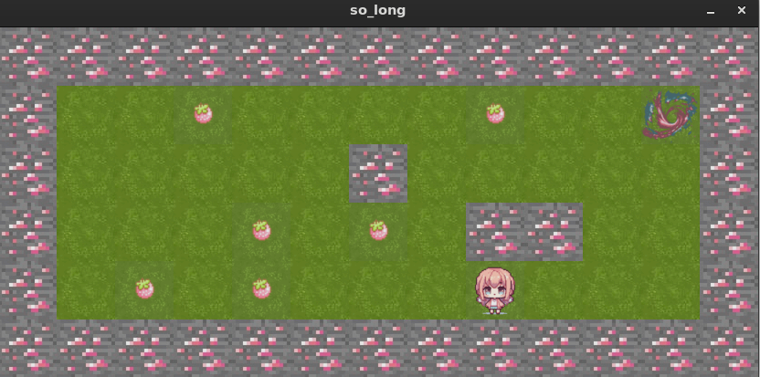

🎮 So Long

  
 
 <strong>A 2D game built in C using MiniLibX as part of the 1337 / 42 curriculum.</strong> 

📌 About

So Long is a small 2D game where the player must collect every coin and then reach the exit.

The project starts with a .ber map file. Before the game is launched, the program parses and validates the map to make sure it follows all the required rules and that the level is actually playable.

The project combines:

🧩 Map parsing
✅ Map validation
🗺️ Flood-fill path validation
🎨 2D rendering
🎮 Keyboard events
🪙 Game state management
🧠 Memory management
🧹 Resource cleanup
🎯 Game Objective

The goal is simple:

Collect all the coins 🪙 and reach the exit 🚪.

The exit can only be used after every collectible has been collected.

Map characters
Character	Description
P	🧍 Player
C	🪙 Collectible
E	🚪 Exit
1	🧱 Wall
0	🌱 Empty space

Example map:

111111111111
1000C0000001
101111101001
100P00000C01
100001111001
100C0000E001
111111111111

🗺️ Map Validation

The map is validated before the graphical window is created.

A valid map must:

Be rectangular
Be completely surrounded by walls
Contain exactly one P
Contain exactly one E
Contain at least one C
Contain only valid characters
Have a valid path from the player
Allow every collectible to be reached
Allow the exit to be reached

If any of these conditions fail, the game does not start and an error is displayed.

🔍 Map processing
              .ber file
                  │
                  ▼
            Read the map
                  │
                  ▼
             Parse data
                  │
                  ▼
          Validate structure
                  │
                  ▼
         Validate characters
                  │
                  ▼
          Check P / C / E
                  │
                  ▼
        Check accessibility
                  │
             ┌────┴────┐
             │         │
          Invalid     Valid
             │         │
             ▼         ▼
           Error    Start game

🧠 Path Validation

A map can have the correct structure but still be impossible to complete.

For example, a collectible could be surrounded by walls and therefore impossible to reach.

To prevent this, I implemented a flood-fill algorithm starting from the player's position.

The algorithm explores every reachable tile while avoiding walls.

This allows the program to verify that:

Player
  │
  ├──► Collectible 1 ✓
  ├──► Collectible 2 ✓
  ├──► Collectible 3 ✓
  │
  └──► Exit ✓

If a required element cannot be reached, the map is rejected.

🎨 MiniLibX

The graphical side of the project is built using MiniLibX, a lightweight graphical library provided within the 42 ecosystem.

MiniLibX allowed me to create the game window, render the map, load images, and react to user events.

Main functions used
Function	Purpose
mlx_init()	Initialize MiniLibX
mlx_new_window()	Create the game window
mlx_xpm_file_to_image()	Load XPM images
mlx_put_image_to_window()	Render images
mlx_key_hook()	Handle keyboard input
mlx_hook()	Handle window/system events
mlx_loop()	Run the event loop
mlx_destroy_window()	Destroy the window

The map is transformed into graphical tiles:

1  →  🧱 Wall
0  →  🌱 Floor
P  →  🧍 Player
C  →  🪙 Coin
E  →  🚪 Exit

🎮 Event Handling

So Long is an event-driven application.

Instead of continuously checking the keyboard, MiniLibX notifies the program when an event occurs.

Keyboard / Window Event
          │
          ▼
      Event Hook
          │
          ▼
      Event Handler
          │
          ▼
      Game Logic
          │
          ▼
      Update State
          │
          ▼
       Re-render

Player movement

When the player attempts to move:

        Player input
             │
             ▼
       Calculate target
             │
             ▼
        Is it a wall?
         /        \
       YES        NO
        │          │
        ▼          ▼
   Don't move   Move player
                   │
                   ▼
             Update game

Walls therefore prevent invalid movement.

🪙 Collectibles & Exit

The game maintains the number of collectibles remaining.

When the player moves onto a coin:

Player moves
     │
     ▼
Coin found?
     │
    YES
     │
     ▼
Collect coin
     │
     ▼
Decrease counter

The exit behaves differently depending on the number of remaining coins:

                 Reach Exit
                     │
             ┌───────┴───────┐
             │               │
        Coins remain     All collected
             │               │
             ▼               ▼
          Continue        🎉 WIN

The player must therefore collect all coins before finishing the level.

🚪 Exiting the Game

The game can be closed at any time using:

ESC

Pressing ESC triggers the keyboard event handler and closes the game.

Window X

Clicking the window's close button triggers a window event and shuts down the game properly.

Both cases go through the event-handling system and the appropriate cleanup functions are called before exiting.

🛠️ Development Process

I developed the project step by step, separating the different parts of the game instead of implementing everything at once.

01 — Parsing

Read the .ber file and convert it into an internal map representation.

02 — Validation

Check:

Dimensions
Characters
Walls
Player
Exit
Collectibles
Accessibility
03 — Game Structures

Create structures to manage:

Map data
Player position
Map dimensions
Collectible count
Exit
MiniLibX
Images
04 — Graphics

Initialize MiniLibX and create the game window.

05 — Rendering

Convert every map character into its corresponding graphical tile.

06 — Movement

Implement keyboard input and prevent the player from moving through walls.

07 — Game Logic

Implement:

Coin collection
Collectible counter
Exit conditions
Win condition
Movement counter
08 — Cleanup

Handle:

ESC
Window close
Game completion
Image destruction
Window destruction
Dynamic memory cleanup
🧰 Technologies
Technology	Usage
C	Main programming language
MiniLibX	Graphics & events
Makefile	Compilation & project management
XPM	Game textures
Unix / Linux	Development environment
File descriptors	Map file reading
Dynamic memory	Map & game structures
Flood Fill	Map accessibility
🚀 Installation
Clone
git clone <YOUR_REPOSITORY_URL>
cd so_long

Compile
make

This generates the executable:

./so_long

Run

Pass a .ber map as an argument:

./so_long maps/map1.ber

You can use any valid map:

./so_long maps/map2.ber
./so_long maps/map3.ber

Example project structure:

so_long/
├── assets/
├── maps/
├── src/
├── Makefile
├── so_long.h
└── README.md

🎮 Controls
Key	Action
W / ↑	Move up
A / ←	Move left
S / ↓	Move down
D / →	Move right
ESC	Exit
X	Close window
🧩 Project Architecture

The project is organized around a simple pipeline:

             ┌─────────────┐
             │  .ber Map   │
             └──────┬──────┘
                    │
                    ▼
             ┌─────────────┐
             │   Parsing   │
             └──────┬──────┘
                    │
                    ▼
             ┌─────────────┐
             │ Validation  │
             └──────┬──────┘
                    │
                    ▼
             ┌─────────────┐
             │ MiniLibX    │
             │ Initialize  │
             └──────┬──────┘
                    │
                    ▼
             ┌─────────────┐
             │  Rendering  │
             └──────┬──────┘
                    │
                    ▼
             ┌─────────────┐
             │   Events    │
             └──────┬──────┘
                    │
                    ▼
             ┌─────────────┐
             │ Game Logic  │
             └──────┬──────┘
                    │
                    ▼
             ┌─────────────┐
             │  Cleanup    │
             └─────────────┘

📚 What I Learned

This project taught me how to turn a simple text file into a complete interactive application.

🧩 Parsing

Reading external files and converting their contents into structured data.

✅ Validation

Checking multiple conditions before allowing the program to continue.

🧠 Algorithms

Using flood fill to determine whether a map is actually playable.

🎨 Graphics

Rendering a complete game world using MiniLibX.

🎮 Events

Working with event callbacks and user input.

💾 Memory Management

Allocating and freeing memory correctly for maps, structures, and graphical resources.

🏗️ Program Architecture

Breaking a larger project into smaller responsibilities:

Parsing
   ↓
Validation
   ↓
Initialization
   ↓
Rendering
   ↓
Events
   ↓
Movement
   ↓
Game State
   ↓
Cleanup

🎯 What This Project Taught Me

The main challenge of So Long was not simply making a character move around a window.

It was learning how different parts of a program work together:

Input
  ↓
Parsing
  ↓
Validation
  ↓
Algorithms
  ↓
Graphics
  ↓
Events
  ↓
Game Logic
  ↓
Cleanup

So Long gave me practical experience with C programming, algorithms, graphics, event handling, memory management, and project organization.

👨‍💻 1337 / 42

So Long — 1337 Coding School / 42 Network

A small 2D game, but a big lesson in parsing, algorithms, graphics, events, and software architecture.